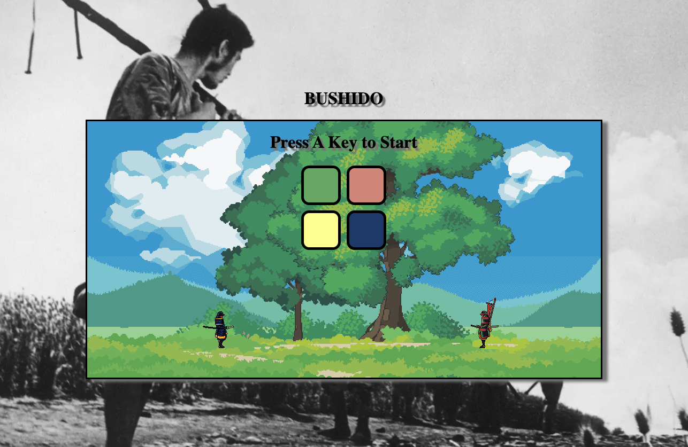
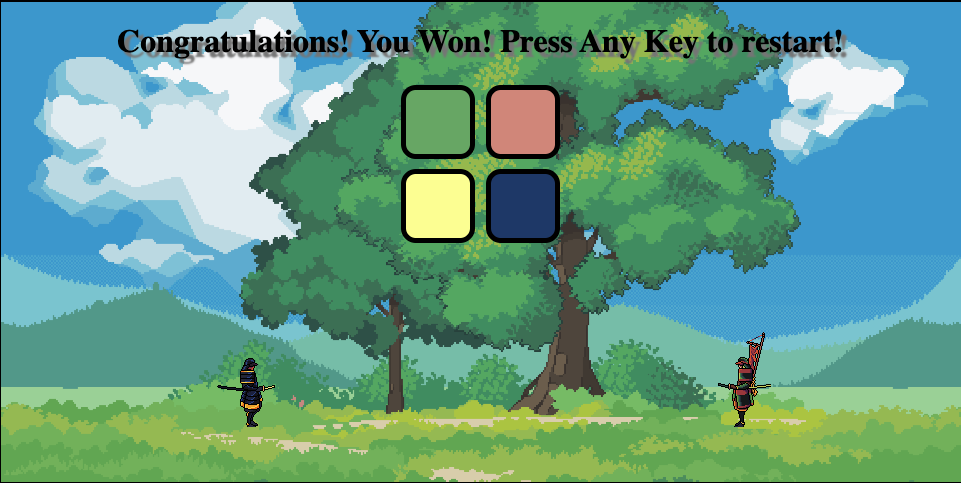
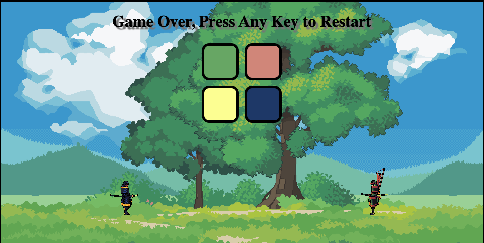

# BUSHIDO
# Simon Game Clone



Re-creation of the classic Simon game, using HTML, Javascript, and CSS.

# A live build can be found [here](https://ardalanmemar93.github.io/BUSHIDO/).

## Tools


## Simon

Simon is a fun and engaging game that not only entertains but also helps improve memory, concentration, and pattern recognition skills. It's a great test of how long a player can remember and repeat increasingly complex sequences of colors and sounds.

- Objective: 
The main goal of Simon is to test and improve your memory. The game will play a sequence of colors and sounds, and your task is to repeat that sequence correctly.

- Gameplay:
Simon starts with two colors in the sequence.
It plays that color's sound and flashes the corresponding button.
The player must then press the button that matches the color they just saw and heard.
Simon then adds one more color to a new sequence.
The player must reproduce the sequence, which now includes the new color.
This process continues, with Simon adding one more color to a new sequence each time.

- Winning and Scoring:
The game continues until the player makes a mistake by pressing the wrong button or forgetting the sequence. There are a total of 5 levels in this game. Once the player wins a message will pop up congratulating the player. 

 If the player enters the wrong sequence a message will pop up saying: Game Over!
 

## Features
- Simple and usable front-end design
- Interactive Gameplay
- Random Sequences
- Sound Effects
- Visual Feedback
- Error Handling
- CSS FlexBox
- Background Images
- Congratulations Message
- Restart Functionality

## Technologies used

In this project, I've used HTML to build the basic structure of the game, CSS to make it look nice and stylish, and JavaScript to add interactivity and game rules. HTML organized the game's elements, CSS made them visually appealing, and JavaScript controlled how the game behaves and responds to user actions. DOM manipulation, done with JavaScript, allowed me to update what's shown on the webpage as the game progresses, like displaying the current level and handling button clicks. All these elements together created an engaging and fun game experience.

## Challenges
- Game Logic: Implementing the game's core logic, including generating random sequences, checking user input, and advancing through levels, required careful planning and coding.

- User Interface: Creating an interactive and visually appealing user interface (UI) with clickable buttons, animations, and responsive design was a significant task.

- Audio Integration: Integrating audio files for button sounds and game over/winning effects involved working with the HTML5 Audio API and managing sound playback.

- Level Management: Tracking and managing game levels, including determining when the player has completed all levels and displaying a "Congratulations" message, required precise coding.

- CSS Styling: Styling the game and UI elements to match the desired aesthetic while ensuring a responsive and visually appealing design was a continuous challenge.

- Event Handling: Implementing event listeners for user input (e.g., button clicks and keypress) and managing the game's state based on these events was a crucial part of the project.

- Error Handling: Handling user mistakes, such as incorrect sequence input, and displaying error messages while maintaining the game's flow and user experience was complex.

- Optimization: Ensuring the game runs smoothly, even with increasing complexity at higher levels, required optimizing the code for performance.

## Favorite Function
- The most challenging function in this project is likely the "checkAnswer" function. This function is responsible for comparing the user's input (userClickedPattern) with the game's generated pattern (gamePattern) and determining whether the user's input matches the current level's game pattern. It involves multiple conditional statements and handling different scenarios, such as when the user completes a level or when they make a mistake. Additionally, it's responsible for displaying messages like "Game Over" and "Congratulations" based on the user's performance, adding complexity to the code.
```js
const checkAnswer = (currentLevel) => {
  if (gamePattern[currentLevel] === userClickedPattern[currentLevel]) {
    if (userClickedPattern.length === gamePattern.length) {
      if (userClickedPattern.join("") === gamePattern.join("")) {
        if (level === totalLevels) {
          // Display "Congratulations" message when the user completes all levels
          document.querySelector("#level-title").textContent =
            "Congratulations! You Won! Press Any Key to restart!";
          setTimeout(() => {
            startOver(); // Reset the game after a delay
          }, 2000);
        } else {
          // User's pattern matches the current level's game pattern
          setTimeout(() => {
            nextSequence();
          }, 1000);
        }
      }
    }
  } else {
    playSound("wrong");
    document.querySelector("body").classList.add("game-over");
    document.querySelector("#level-title").textContent =
      "Game Over, Press Any Key to Restart";

    setTimeout(() => {
      document.querySelector("body").classList.remove("game-over");
    }, 200);

    startOver();
  }
};

```

## Future
- [ ] Mobile support
- [ ] Difficulty mode (speed inclines quicker)
- [ ] Animate the samurai (have them battle one another)
- [x] background music with play/pause and a volume button
- [ ] Change up the sounds to suit the theme better
- [ ] Add buttons for the samurai animations 